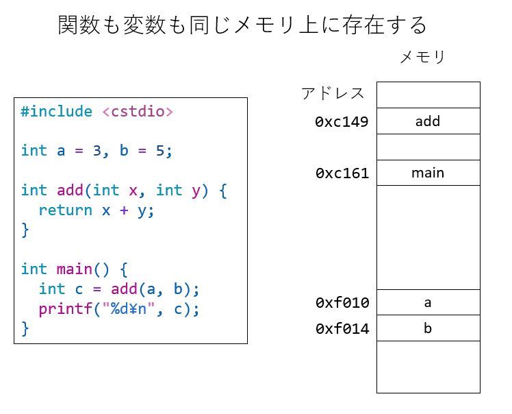

# ヘッダファイル

C/C++でPythonでの`import`文にあたるのが`#include`文だが、Pythonのimport文とは仕組みが大きくことなる。`#include`は、その名の通り、ファイルをインクルードする仕組みで、インクルードされるファイルをインクルードファイル、もしくはヘッダファイルと呼ぶ。C/C++に慣れていないと、ヘッダファイルをどのように使うべきかよくわからないであろう。

`#include`の動作は非常に単純だが、ヘッダファイルの存在意義を知るためには、分割コンパイルを知る必要があり、分割コンパイルを知るためには、リンクを知る必要があり、リンクを知るためにはそもそも「関数呼び出しとは何か」を知る必要がある。非常に迂遠だが、変に急いでも理解が難しくなるので、一つ一つ説明してみよう。

## 関数呼び出しとアドレス

個人的な意見だが、C/C++を理解するためには、「プログラムもデータも全てメモリ上に存在する」というイメージを掴むのが一番早いと思う。変数がメモリ上に存在するというイメージはつかみやすいが、プログラムもメモリ上に存在している。関数とは、メモリ上のある範囲に住んでいるひと塊のプログラムであり、関数呼び出しとは、その関数の先頭アドレスにジャンプし、最後に戻ってくるという一連の動作のことだ。

こんなコードを見てみよう。単純に二つの変数を受け取って、その和を返す関数`add`を`main`関数から呼び出している。後のために、変数`a`と`b`はグローバル変数として宣言してある。

```cpp
#include <cstdio>

int a = 3, b = 5;

int add(int x, int y) {
  return x + y;
}

int main() {
  int c = add(a, b);
  printf("%d\n", c);
}
```

さて、先に述べたように、プログラムもデータも全てメモリ上に存在している。この`add`や`main`といった関数も、`a`、`b`といった変数も、全てメモリ上にある。メモリには通し番号がついており、その場所を一意に指定できる。この通し番号を「アドレス」もしくは「番地」と呼ぶ。変数も関数もメモリ上に存在するのであるから、当然「メモリ上のどこにあるか」を指定するアドレスを持っている。それを見てみよう。

```cpp
#include <cstdio>

int a = 3, b = 5;

int add(int x, int y) {
  return x + y;
}

int main() {
  int c = add(a, b);
  printf("%d\n", c);
  printf("add : %p\n", add);
  printf("main: %p\n", main);
  printf("a   : %p\n", &a);
  printf("b   : %p\n", &b);
}
```

これは、関数`add`と`main`、変数`a`と`b`のアドレスを表示するものだ。実行してみよう。

```sh
$ g++ call2.cpp
$ ./a.out
8
add : 0x564fa4c3c149
main: 0x564fa4c3c161
a   : 0x564fa4c3f010
b   : 0x564fa4c3f014
```

OSによっては、実行するたびにアドレスが変わるかもしれない。それは「Address Space Layout Randomization (ASLR)」というセキュリティ上の仕組みが走っているためだが、ここでは触れない。いずれにせよ、add, main, a, bがメモリ上にアドレスを持ち、同じような場所に固まって存在している、ということがわかると思う。



プログラムはメモリ上にあり、上から順番に解釈、実行されていく。関数とはひとまとまりのプログラムもことであり、関数呼び出しとは、呼び出し元のアドレスを覚えておいて、呼び出す関数のアドレスにジャンプすることだ。飛んだ先で関数の処理が終わったら、先ほど覚えておいたアドレスへと戻ってくる。これが関数呼び出しの仕組みだ。要するに関数呼び出しとは、メモリ上で行って帰ってくるジャンプに過ぎない。

## 分割コンパイル

C++には分割コンパイルという仕組みがある。よく使う関数を毎回コンパイルするのは面倒だ。そこで、よく使う関数をまとめてあらかじめコンパイルしておく。すると、その関数以外の部分だけコンパイルし、あとてそれらをくっつければ良い。コンパイルした結果生まれるファイルをオブジェクトファイル、オブジェクトファイルに必要なものをくっつけて実行バイナリを作ることをリンクという。

さて、実際に分割コンパイルしてみよう。先ほどの`add`関数だけ別のファイル、`add.cpp`に逃がす。

```cpp
int add(int x, int y) {
  return x + y;
}
```

これをそのままコンパイルすると`main`関数がないよ、と怒られる。

```sh
$ g++ add.cpp
/usr/bin/ld: /usr/lib/gcc/x86_64-linux-gnu/9/../../../x86_64-linux-gnu/Scrt1.o: in function `_start':
(.text+0x24): undefined reference to `main'
collect2: error: ld returned 1 exit status
```

ここでエラーを出しているのが`/usr/bin/ld`というプログラムであることに注意したい。これは「リンカ」と呼ばれて、リンクするためのプログラムだ。実は`g++`はコンパイルドライバと呼ばれ、後ろでプリプロセッサやコンパイラ、リンカを適切に呼び出す役目を果たしている。`g++`に何も指示しないと、そのプログラムをコンパイルするだけでなく、リンクもして、実行バイナリを作ろうとする。コンパイルは成功するが、`main`関数がないためにそのあとのリンクに失敗し、このようにエラーで止まる。

ここでは「コンパイルだけして、リンクはしなくて良いよ」と教えるために`-c`オプションを付ける。

```sh
g++ -c add.cpp
```

こうすると、`add.o`ができる。これがオブジェクトファイルだ。この中に関数`add`の実体が入っている。

次に、`main`関数だけを含むファイル`main.cpp`を作ろう。

```cpp
#include <cstdio>

int a = 3, b = 5;

int main() {
  int c = add(a, b);
  printf("%d\n", c);
}
```

これも`-c`オプションをつけてコンパイルしよう。

```sh
$ g++ -c main.cpp
main.cpp: In function ‘int main()’:
main.cpp:6:11: error: ‘add’ was not declared in this scope
    6 |   int c = add(a, b);
      |
```

`add`が定義されていないよ、と怒られた。分割コンパイルをするためには、現時点で`add`の実体は不要だが、`add`の関数の「形」は教えてやる必要がある。「形」とは、どんな引数をどんな順番で取って、どんな返り値を持つかなどだ。今回のケースでは、`main`関数の冒頭に以下の行を追加すれば良い。

```cpp
int add(int a, int b);
```

これを関数のプロトタイプ宣言と呼ぶ。プロトタイプ宣言に必要なのは型だけだから、`int a`の`a`は書かなくても良い。

```cpp
int add(int , int);
```

これも正しいプロトタイプ宣言だ。これを含めると`main.cpp`はこうなる。

```cpp
#include <cstdio>

int add(int, int);

int a = 3, b = 5;

int main() {
  int c = add(a, b);
  printf("%d\n", c);
}
```

これを`g++ -c`でコンパイルすると、`main.o`ができる。この状態で、`main.o`と`add.o`をくっつけよう。

```sh
$ g++ main.o add.o
$ ./a.out
8
```

できた実行バイナリを実行すると、ちゃんと正しく実行できた。

ちなみに、くっつけるのはリンカの仕事なのだが、`ld`でくっつけると実行バイナリができない。

```sh
$ ld main.o add.o
ld: warning: cannot find entry symbol _start; defaulting to 0000000000401000
ld: main.o: in function `main':
main.cpp:(.text+0x36): undefined reference to `printf'
```

なぜ単にリンカでリンクするだけで実行バイナリができないのか、なぜg++にリンクさせると実行バイナリができるのか等の詳細は筆者の説明能力を超える。詳しくは[tanakamura](https://github.com/tanakamura)さんの[実践的低レイヤプログラミング](https://tanakamura.github.io/pllp/docs/)などを参照して欲しい。

さて、有用な関数を集めたファイルを作り、あらかじめコンパイルしておいたとしよう。それらの関数群を別のファイルから使うためには、プロトタイプ宣言をする必要がある。例えば整数の四則演算をする関数群をまとめたとして、それを使うためには

```cpp
int add(int, int);
int sub(int, int);
int mul(int, int);
int div(int, int);
```

と書かないとならない。さらに、整数以外の関数も実装したなら、

```cpp
int add(int, int);
int sub(int, int);
int mul(int, int);
int div(int, int);
float add(float, float);
float sub(float, float);
float mul(float, float);
float div(float, float);
```

などとしなければならない。こんなものを毎回書くのは面倒だ。そもそもプロトタイプ宣言は、まとめた関数とセットと配布されるべきであろう。こうして用意されたのがヘッダファイルである。

今回のケースでは、以下のようなファイル`add.h`を作る。

```cpp
int add(int, int);
```

これは関数`add`のプロトタイプ宣言を行うだけのファイルだ。これを`main`関数のあるファイルに取り込んでやれば良い。それが`#include`だ。

```cpp
#include <cstdio>

#include "add.h"

int a = 3, b = 5;

int main() {
  int c = add(a, b);
  printf("%d\n", c);
}
```

`#include "add.h"`は、「この場所に`add.h`のファイルを読み込んで展開しろ」という意味だ。ただ文字通り展開するだけである。このように`#`から始まる命令をディレクティブ(directive)と呼ぶ。ディレクティブとは、プログラムとは別にコンパイラに「こうしなさい」と指示する命令だ。ディレクティブが機能するのは、プログラムの実行時ではなく、コンパイル時である。

## プリプロセッサ

`#include`は、続くファイルをその場に読み込むことをコンパイラに指示するディレクティブである。実際にこれを処理するのはプリプロセッサと呼ばれるプログラムだ。その動作を見てみよう。

いま、こんなヘッダファイルを作ろう(`test.h`)。

```cpp
const char *msg = "Hello! This is test.h\n";
```

そして、それをインクルードするだけのファイル(`test.cpp`)を作る。後でわかるように変数定義を置いておこう。

```cpp
#include "test.cpp"
const char *msg2 = "Hello! This is test.cpp\n";
```

コンパイラにこのファイルを食わせると、まずプリプロセッサと呼ばれるプログラムが走って、ディレクティブを処理する。その振る舞いを見るには、`g++`に`-E`というオプションを与えてファイルを食わせれば良い。

```sh
$ g++ -E test.cpp
# 1 "test.cpp"
# 1 "<built-in>"
# 1 "<command-line>"
# 1 "/usr/include/stdc-predef.h" 1 3 4
# 1 "<command-line>" 2
# 1 "test.cpp"
# 1 "test.h" 1
const char *msg = "Hello! This is test.h\n";
# 2 "test.cpp" 2
const char *msg2 = "Hello! This is test.cpp\n";
```

すると、標準出力にプリプロセッサが処理した後の結果が表示される。いろいろディレクティブが追加されているが、基本的には`test.cpp`の`#include`があった場所に`test.h`の内容が展開されていることがわかる。

同様にプリプロセッサが処理するディレクティブに`#ifdef`と`#endif`がある。`#ifdef`は後ろにトークンをとり、それが定義されていれば次の`#endif`までが有効になるが、定義されていなければ`#endif`まで読み飛ばすというものだ。試してみよう。

こんなファイル(`ifdef.cpp`)を書いてみる。

```cpp
#ifdef HOGE
const char *msg = "Hoge is defined!";
#endif
```

これをプリプロセッサに食わせてみよう。

```sh
$ g++ -E ifdef.cpp
 1 "ifdef.cpp"
# 1 "<built-in>"
# 1 "<command-line>"
# 1 "/usr/include/stdc-predef.h" 1 3 4
# 1 "<command-line>" 2
# 1 "ifdef.cpp"
```

`HOGE`なんてトークンは定義されていないので、`#ifdef`から`#endif`まで読みよばされてしまう。このトークンを定義するには`#define`を使う。

```cpp
#define HOGE

#ifdef HOGE
const char *msg = "Hoge is defined!";
#endif
```

今度は`HOGE`が定義されているので、`#ifdef HOGE`が有効となり、`#endif`までが読み飛ばされない。

```sh
$ g++ -E ifdef2.cpp
# 1 "ifdef2.cpp"
# 1 "<built-in>"
# 1 "<command-line>"
# 1 "/usr/include/stdc-predef.h" 1 3 4
# 1 "<command-line>" 2
# 1 "ifdef2.cpp"


const char *msg = "Hoge is defined!";
```

なお、この`#define`はコンパイル時に`-D`オプションで与えることもできる。

```sh
$ g++ -E -DHOGE ifdef.cpp
# 1 "ifdef.cpp"
# 1 "<built-in>"
# 1 "<command-line>"
# 1 "/usr/include/stdc-predef.h" 1 3 4
# 1 "<command-line>" 2
# 1 "ifdef.cpp"

const char *msg = "Hoge is defined!";
```

`ifdef.cpp`の中では`HOGE`は未定義だが、コンパイル時に定義してやったので、`#ifdef HOGE`が有効になった。

なお、`#define HOGE 1`のように、トークンに値を定義することもできる。例えば、こんなコードが書ける。

```cpp
#include <cstdio>

#define N 10

int main() {
  for (int i = 0; i < N; i++) {
    printf("%d\n", i);
  }
}
```

`#define N 10`は、「以後、Nを見かけたら10に置換しなさい」という指示だ。この置換は、C/C++プログラム的に正しいかどうかなどは全く気にせず、文字列置換として実施される。したがって、思わぬバグの温床となる。

現在では定数を扱う場合は

```cpp
#include <cstdio>

const int N = 10;

int main() {
  for (int i = 0; i < N; i++) {
    printf("%d\n", i);
  }
}
```

などと、`const`をつけてC/C++のプログラムとして定数を宣言する。

しかし、`#define`は絶滅したかというとそうではなく、例えばアーキテクチャごとに異なる処理をしたいが、それらを同じファイルに書きたい時などに使われる。

```cpp
void force_calculation(){
#ifdef ARM64
// ARM64用の処理
#endif //ARM64
#ifdef x86
// x86用の処理
#endif //x86
}

自分でこういうコードを書くことは少ないと思われるが、見かけた時にびっくりしないで欲しい。

## インクルードガード

C++は別の場所で定義された関数や変数、定数を使うためにヘッダファイルを使う。Pythonでも、他に用意されたライブラリやパッケージを使う際に`import`文を使うが、こちらはもう少し考えていろいろやってくれる。例えば、同じパッケージを二度importしても大丈夫だ。

```py
import random
import random  # 問題なく実行される(無視される)

print(random.random())
```

しかし、C/C++のinclude文は「そのまま」インクルードするだけなので、二回やるとおかしなことになる場合がある。

関数のプロトタイプ宣言は何度実行しても良いが、例えば変数の宣言は二度できない。こんなヘッダファイル`const.h`を考えよう。

```cpp
const double my_pi = 3.141592;
```

後で使う定数を宣言したファイルだ。これをインクルードして表示してみよう(`const.cpp`)。

```cpp
#include <cstdio>

#include "const.h"

int main() {
  printf("%f\n", my_pi);
}
```

これは問題なく実行できる。

```sh
$ g++ const.cpp
$ ./a.out
3.141592
```

しかし、二度インクルードすると「同じ変数宣言を二回やってるよ」怒られる。

```cpp
#include <cstdio>

#include "const.h"
#include "const.h"

int main() {
  printf("%f\n", my_pi);
}
```

```sh
$ g++ const_twice.cpp
In file included from const_twice.cpp:4:
const.h:1:14: error: redefinition of 'const double my_pi'
    1 | const double my_pi = 3.141592;
      |              ^~~~~
In file included from const_twice.cpp:3:
const.h:1:14: note: 'const double my_pi' previously defined here
    1 | const double my_pi = 3.141592;
      |              ^~~~~
```

簡単な対策はもちろん、同じファイルを二度インクルードしないようにすることだが、実際にそれは難しい。なぜなら、インクルードファイルは多段になる場合があるからだ。

例えば`a.h`が`x.h`をインクルードしており、`b.h`が`y.h`をインクルードしており、さらに`y.h`が`x.h`をインクルードしているとしよう。

この状態で`a.h`と`b.h`をインクルードすると、`x.h`を二度インクルードしてしまう。一般にインクルードファイルの数は多くなる傾向にあり、その全てに重なりがないことを確認するのは非現実的だ。そこで、「一度インクルードされたら、二度目は無視する」仕組みが欲しくなる。それがインクルードガードである。

具体的には、先ほどの`const.h`をこう書きなおす。

```cpp
#ifndef CONST_H
#define CONST_H
const double my_pi = 3.141592;
#endif
```

すると、二度インクルードしても問題なくコンパイルできるようになる。

```sh
$ g++ const_twice.cpp
$ ./a.out
3.141592
```

仕組みを説明しよう。まず、`#ifndef CONST_H`とは、`#ifdef`とは逆に、`CONST_H`が定義されて**いなければ**`#endif`までを有効にしなさい、という意味だ。最初はそんなものは定義されていないので、`#ifndef`から`#ifdef`が有効となる。

次にある`#define CONST_H`は`CONST_H`を定義せよ、という命令である。そして、ヘッダファイルの本体が続く。

最後に`#endif`がある。これは対応する`#ifdef`や`#ifndef`と対をなし、条件に対応して、それで囲まれた領域が有効になったり無視されたりする。

さて、`#include`は問答無用でファイルをインクルードする命令であったから、二度インクルードするとこんな感じに展開される。

```cpp
#ifndef CONST_H // 1.
#define CONST_H // 2.
const double my_pi = 3.141592; // 3.
#endif // 4.

#ifndef CONST_H　// 5.
#define CONST_H
const double my_pi = 3.141592;
#endif // 6.
```

頭から見てみよう。

1. 最初に`CONST_H`が定義されているかどうか調べている。未定義なので、次に出現する`#endif`までの記述が有効になる
2. `CONST_H`を定義する。これにより、次の`#ifndef CONST_H`は条件を満たさなくなる
3. ヘッダファイル本体
4. ここまでが有効となる
5. 二度目の`#ifndef CONST_H`。今回は既に`CONST_H`が定義されているので、対応する`#endif`までコンパイラ(正しくはプリプロセッサ)がファイルを読み飛ばす
6. `#endif`を見つけたので、読み飛ばし終了。次の行からまた真面目に読む。

これにより、同じファイルが二度インクルードされても、二度目は無視するようになる。このように

```cpp
#ifndef HOGE_H
#define HOGE_H
....
#endif
```

で囲むテクニックを「インクルードガード」と呼ぶ。`HOGE_H`の部分は適当で良いが、一般的にはファイル名から作る。

さて、上記を見て、「あまりにもアドホックだ」と感じたことだろう。ファイルの最初と最後に書かないといけない、というのも面倒だし、`#ifndef`や`#define`の後ろにくるトークンは、他とぶつからないように定義しなければならず、とても現代的なプログラミング言語の仕様とは思えない。そこで、多くのコンパイラが`#pragma once`というディレクティブをサポートしている。

ヘッダファイルの頭に`#pragma once`と書くと、二度目に読み込まれた時にこのファイルは無視される。

```cpp
#pragma once
const double my_pi = 3.141592;
```

こうしても`const_twice.cpp`は問題なくコンパイルされる。

この`#pragma once`ディレクティブは、ファイルの冒頭に一行書くだけだし、ユニークなトークンを考える必要もないので便利だが、C++の**非標準機能**である。つまり、言語仕様として正式に認められた機能ではない。

なぜ標準化されないのか等は、適当にググってC++の闇に震えてもらうことにして、基本的には普段使うコンパイラは`#pragma once`はサポートしていると思われるので、自分でヘッダファイルを書く際はそっちを使っておけば良い。

ただし、ちょっと古いコードなどを見ると`#ifndef`から`#endif`で囲まれたインクルードガードが使われていることが多いので、もし見かけたら「あぁ、インクルードガードだなぁ」と思って欲しい。

## リンカのお仕事

TODO: せっかく関数がメモリ上にあると書いたんだから、リンカの仕事も少し触れる？ readelfとかで関数のアドレスとか表示させるとか？

## まとめ

よく使う関数をまとめてあらかじめコンパイルしたものを「ライブラリ」と呼ぶ。そのライブラリを使う際に、関数のプロトタイプ宣言が必要となるので、それを`#include`でインクルードしてやる。この`#include`は文字通りファイルをそのままインクルードするだけなので、同じファイルを複数回インクルードするとおかしくなる。それを防ぐのがインクルードガードであったり、`#pragma once`ディレクティブであったりする。この`#include`や`#define`を処理するプログラムがプリプロセッサで、プリプロセッサはC/C++のプログラムとは無関係に、ただ機械的に処理を行う。なので、必要がなければ`#define`などは使わない方が良い。