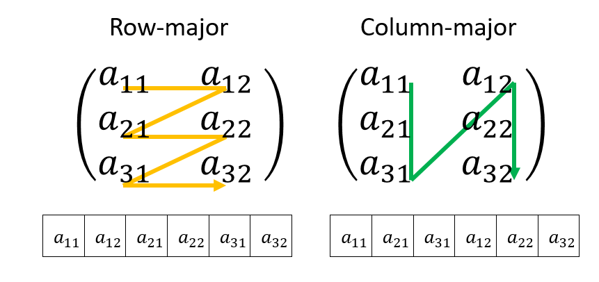

# 多次元配列とデータレイアウト

## 多次元配列

C++における配列は、ポインタとオフセットの糖衣構文であることを見た。次に、多次元配列の実現方法について見てみよう。C++において多次元配列は以下のように宣言する。

```cpp
int a[3][2];
```

これは3行2列の行列を表す。「行(Row)」と「列(Column)」のどっちがどっちかよくわからなくなる人(私)のために、図解しておこう。


さて、`int a[3][2]`は3行2列の行列であるから、要素は3x2の6個ある。この6個のデータはメモリに一次元的に連続に並んでいる。

この時、データの並べ方には「Row-major」と「Column-major」の二種類の方法がある。「Row-major」は、まず列が増えて行き、列の最後までいきあたったら行が増えて、また列が増えていく、というレイアウトで、「Column-major」はその逆だ。



