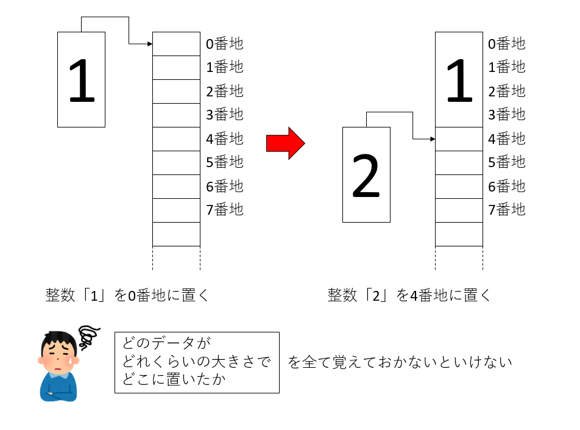
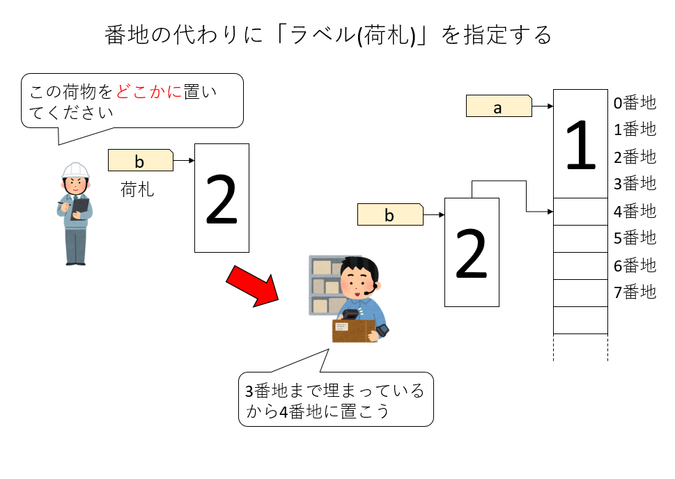
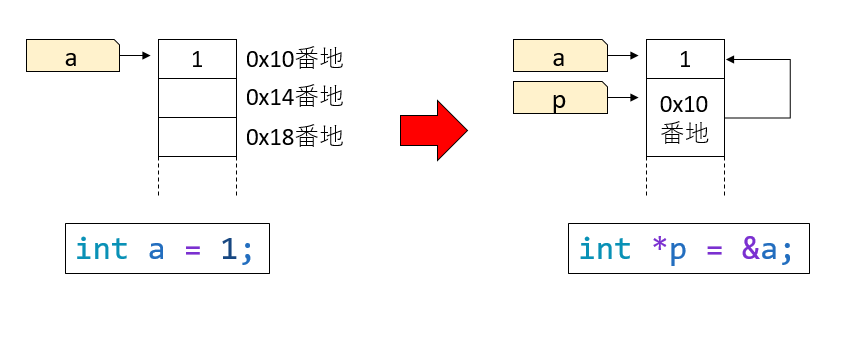
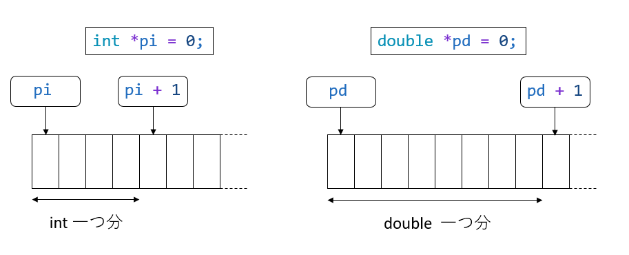
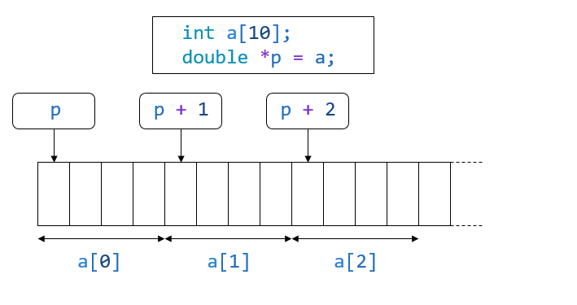

# ポインタと配列

C/C++において、初学者の鬼門となるのがポインタの概念である。モダンなC++においては、生のポインタを意識することはほとんどなくなったのだが、SIMD化など、低レイヤを考える場合には避けて通ることはできない。

また、個人的にはプログラムの動作を理解するのに、ポインタのようなものを先に理解してしまった方がいろいろ捗るのではないかと思う。

ここでは、C++(というかC言語)のポインタについて説明する。

## 変数とメモリ

Pythonの講義でも触れたが、変数というのはメモリにつけられたラベルである。我々がデータを扱う際、そのデータをメモリに置いて、それを操作する。コンピュータのメモリは、馬鹿でかい一次元配列のようなものだ。メモリには「アドレス」と呼ばれる連続の「番地」がふられている。コンピュータは、例えば「1+2」を計算する際、

* 「1」のデータをメモリに置く
* 「2」のデータをメモリに置く
* 「1」のデータをメモリから取ってきてレジスタに載せる
* 「2」のデータをメモリから取ってきてレジスタに載せる
* 足し算をする
* 結果である「3」をメモリに書き戻す

といった作業をする。さて、メモリからデータを取ってくるには、番地を指定する必要がある。なので、プログラマは「どの番地に、どんなデータを置いているか」を自分で覚えておかなければならない。

また、「1」のデータと「2」のデータは重なってはいけないが、隙間があいてもメモリがもったいない。なので「1」はどこに置いたか、データが何バイトあるかを考えて、「2」のデータをおかなければならない。例えば整数は4バイトなので、「1」を0番地に置いたら、次は「2」を4番地に置く必要がある。例えば2番地や3番地に次のデータを置いたら、前のデータは破壊されてしまう。



このように、原初のプログラムでは「どのデータが」「どのくらいの大きさで」「どこに置いたか」を全てプログラマが覚えておかなければならなかった。

そんな面倒なことをいちいちやってられないので、コンピュータに任せたくなるのが人情だ。そこでメモリの「番地」にラベルを貼ることにしよう。人間はデータにラベルを貼り、それをデータ管理人に「適当に置いてください」と依頼する。するとデータ管理人は、データのサイズを見て、メモリのどこに置くかを決める。データが欲しい時には、ラベルを言って持ってきてもらえばよい。



このラベルが「変数」、データ管理人が言語処理系だ。Pythonは実行時にデータをどこに置くか決めるが、C++はコンパイル時に場所を決める。

とは言え、メモリの「番地」はあまり実感がわかないであろう。そこで、この番地を直接見てみることにしよう。

## 変数のアドレス

まず、`int`型の変数`a`を宣言しよう。

```cpp
int a;
```

C++では、コンパイル時にこの変数`a`がメモリのどこに置かれるかが決定される。その場所を「アドレス」と呼ぶ。ある変数のアドレスを知るには、その変数に`&`を付ければ良い。

```cpp
#include <cstdio>

int a;
int main(){
  printf("%p\n",&a);
}
```

実行結果は環境によるが、例えば以下のような結果が得られる。

```sh
$ g++ address.cpp
$ ./a.out
0x7f58d1c01014
```

変数`a`のアドレス、すなわち`a`が指すデータが置かれたメモリの場所が、`0x7f58d1c01014`番地であることがわかる。なお、頭の`0x`は、この値が16進法表記であることを示す。

先ほどのコードに、変数を一つ増やしてみよう。

```cpp
#include <cstdio>

int a;
int b;
int main(){
  printf("%p\n",&a);
  printf("%p\n",&b);
}
```

`int a;`の次に、`int b;`を置いた。`int`型は4バイトなので、`b`は`a`の4バイト分後に置かれるはずである。コンパイル、実行してみよう。

```sh
$ g++ address2.cpp
$ ./a.out
0x7f1d66601014
0x7f1d66601018
```

最後二桁だけ見ると、`a`のアドレスが`0x14`番地に、`b`のアドレスが`0x18`番地となり、期待通り`b`が`a`の4バイトあとに配置された。

`int a;`を、`double a`に変えてみよう。

```cpp
#include <cstdio>

double a;
int b;
int main(){
  printf("%p\n",&a);
  printf("%p\n",&b);
}
```

実行結果は例えばこうなる。

```sh
$ g++ address3.cpp
$ ./a.out
0x7feb30e01018
0x7feb30e01020
```

最後の二桁を見ると、`double a`が`0x18`番地に、`int b`が`0x20`番地に配置された。これは16進法で表示されているので、10進法になおすと、24番地と32番地となり、8バイトずれていることがわかる。これは`double a`が倍精度実数で64ビット、8バイトであることによる。

## ポインタ

さて、`int a`は`int`型の変数を宣言しており、`&a`は、そのアドレスを指す。この「`int`型の変数のアドレス」を指す変数を作ることができる。これが「ポインタ」である。

ポインタは、型の後に`*`マークをつけて宣言する。

```cpp
int *p;
```

これにより、`p`は「`int`型の変数のアドレスを指す変数」となる。例えば、`int`型の変数`a`のアドレス、`&a`を`p`に代入することができる。

```cpp
int a;
int *p;
p = &a; // aのアドレスをpに代入する。
```

この時、`p`には`a`の「アドレス」が入っている。つまり、`a`の場所を「指して(pointing)」いるので、`p`はポインタ(pointer)と呼ばれる。C++では、変数の値の代入は同じ型同士でないとできない(暗黙の型変換については後述)。このことから`&a`という変数が`int *`という型を持っていることがわかる。



`int`だろうが`double`だろうが、どのような型のデータであろうと、メモリ上でのアドレスは番地で指定できる。

例えば、以下のようなコードを考えてみよう。

```cpp
#include <cstdio>

int i;
double d;
int *pi = &i;
double *pd = &d;

int main(){
  printf("%p\n", pi);
  printf("%p\n", pd);
}
```

コンパイル、実行してみると、

```sh
$ g++ pointer.cpp
$ ./a.out
0x7fa791001028
0x7fa791001030
```

`int *`型のpiと、`double *`型のpd、どちらもアドレスを値として持っていることがわかる。

しかし、ポインタにも「型」があり、例えば`double`を指すポインタである`double *`型のポインタは、`int`の変数のアドレスを受け取ることができない。

```cpp
  int a;
  double *p = &a;　// ←ここでコンパイルエラーになる
```

では、なぜポインタに型が必要か。実は、ポインタの型は、加減算をしたときにその違いが現れる。こんなコードを考えてみよう。

```cpp
#include <cstdio>

int main(){
  int *pi = 0;
  double *pd = 0;
  printf("%p\n",pi+1);
  printf("%p\n",pd+1);
}
```

`int *`型のポインタ`pi`と、`double *`型のポインタ`pd`を0で初期化し、それぞれ1を足したアドレスを表示している。結果は以下のようになる。

```sh
$ g++ pointer_inc.cpp
$ ./a.out
0x4
0x8
```

`pi`も`pd`も0番地のアドレスを指していたが、`pi+1`は`0x4`番地を指している。これは、`pi+1`は、「`pi`が指すアドレスから`int`一個分だけ後ろのアドレス」を意味するからだ。`pd+1`が`0x8`番地を指す理由も同様である。



なぜ、「ポインタに1を足すと、そのポインタの指す型のサイズだけアドレスがずれるのか」を理解するためには、C++(C言語)の配列について理解する必要がある。

## ポインタのデリファレンス

以下のコードで、`int a`の値があるアドレスを`p`に代入できる。

```sh
int a = 12345;
int *p = &a;
```

さて、「`p`が指すアドレスにある値」を参照したい時には、`*p`と、ポインタの前にアスタリスクをつける。つまり、`a`と`*p`は同じ値を持つ。

```sh
#include <cstdio>

int a = 12345;
int *p = &a;

int main(){
  printf("Address of a is %p\n",p);
  printf("Value of a is %d\n",*p);
}
```

上記を実行すると以下のような表示が得られる。

```sh
Address of a is 0x7f66e2401010
Value of a is 12345
```

このように、「ポインタ」から「ポインタの指す先の値」を得ることを「ポインタのデリファレンス」もしくは単に「デリファレンス(dereference)」と呼ぶ。

## 配列

特に数値計算においては、複数のデータをまとめて扱いたいことが多い。そのためにC/C++では配列という仕組みが用意されている。これはPythonで言うところのNumPy配列のようなものだ(Pythonのリストとはちょっと異なる)。

例えば、`int`型のデータを10個まとめた配列は以下のように宣言する。

```cpp
int a[10];
```

これで、整数型のデータを10個まとめて扱えるようになった。10個のデータの最初のデータは`a[0]`で、2個目のデータは`a[1]`でアクセスできるのはPythonと同じである。さて、この`a[0]`や`a[1]`でデータがアクセスできる仕組みをもう少し詳しく見てみよう。

まず、`int a[10]`と定義したときに`a`とは何か。これは10個の連続した整数のデータの「最初のデータの場所」を指している。データの場所、すなわちアドレスを保持しているのだから、これはポインタである。実際、`int *`型のポインタに`a`をそのまま代入することができる。

```cpp
int a[10];
int *p = a; // コンパイラに怒られない
```

もちろん、異なる型ならコンパイルが通らない。

```cpp
int a[10];
double *p = a; // コンパイルエラー
```

上記をコンパイルすると、「`int *`を`double *`に変換んできない」というエラーが出てコンパイルできない。

さて、

```cpp
int a[10];
int *p  = a;
```

とした時、`p`はどこを指しているかというと、`a[10]`の先頭、すなわち`a[0]`を指している。したがって、`p`の指すアドレスと、`a[0]`の値があるアドレスを表示すると同じものになる。確かめてみよう。

```cpp
#include <cstdio>

int a[10];
int *p = a;

int main(){
  printf("%p\n",p);
  printf("%p\n",&a[0]);
}
```

```sh
$ g++ array.cpp
$ ./a.out
0x7fd939c01040
0x7fd939c01040
```

`p`の指すアドレスと、`a[0]`が同じアドレスを指すことがわかる。

では、`a[1]`はどうだろうか？`a[0]`の隣にあるのだから、`int`一つ分ずれたアドレスにあると予想される。そして、`p+1`は`p`から`int`一つ分アドレスがずれるのだから、`p+1`と`a[1]`は同じアドレスを指す。

確かめてみよう。

```cpp
#include <cstdio>

int a[10];
int *p = a;

int main(){
  printf("%p\n",p+1);
  printf("%p\n",&a[1]);
}
```

```sh
$ g++ array2.cpp
$ ./a.out
0x7f4bc4c01044
0x7f4bc4c01044
```

確かに`p+1`と`a[1]`は同じ場所を指していた。



さて、`a[1]`は、配列`a`の2番目のデータを指していた。では`a`とはなんだろうか？

実は、`a`は`int *`型のポインタである。なので、わざわざ`int *p`に代入しなくても、`a`を使って同じことができる。

```cpp
#include <cstdio>

int a[10];

int main(){
  printf("%p\n",&a[1]);
  printf("%p\n",a+1);
}
```

実行結果。

```sh
$ g++ array3.cpp
$ ./a.out
0x7f7ed6401044
0x7f7ed6401044
```

つまり、`&a[1]`と`a+1`は同じものだ。したがって、(a+1)をデリファレンスすると、`a[1]`の値を得ることができる。

```cpp
#include <cstdio>

int a[10] = {0,1,2,3,4,5,6,7,8,9};

int main(){
  printf("Value of   a[1] is %d\n",a[1]);
  printf("Value of *(a+1) is %d\n",*(a+1));
}
```

実行結果。

```sh
$ g++ array4.cpp
$ ./a.out
Value of   a[1] is 1
Value of *(a+1) is 1
```

実は、C/C++の配列表現`x[y]`は、`*(x+y)`と全く等価である。むしろ、`x[y]`とは、`*(x+y)`の意味をわかりやすくしたものだ。このような書き方を糖衣構文(syntax sugar)と呼ぶ。「糖衣」とは、苦い薬などを飲みやすくするために、周りに砂糖をコーティングすること(sugar coating)だ。`*(x+y)`と書くよりも、`x[y]`と書く方が、先頭アドレスが`x`で、そこからのずれ(オフセットが)`y`であることがわかりやすい。

C/C++においては、あくまで`x[y]`は`*(x+y)`の書き換えに過ぎないから`x[y]`も`y[x]`も同じ意味となる。

したがって、`a[1]`は`1[a]`と同じ意味となる。

```cpp
#include <cstdio>

int a[10] = {0,1,2,3,4,5,6,7,8,9};

int main(){
  printf("Value of   a[1] is %d\n",a[1]);
  printf("Address of a[1] is %p\n",&a[1]);
  printf("Value of   1[a] is %d\n",1[a]);
  printf("Address of 1[a] is %p\n",&(1[a]));
  printf("Value of *(a+1) is %d\n",*(a+1));
  printf("Address pointed by a+1 is %p\n",a+1);
} 
```

```sh
$ g++ array5.cpp
$ ./a.out
Value of   a[1] is 1
Address of a[1] is 0x7f716a401024
Value of   1[a] is 1
Address of 1[a] is 0x7f716a401024
Value of *(a+1) is 1
Address pointed by a+1 is 0x7f716a401024
```

これは、`a[1]`が`*(a+1)`の糖衣構文であり、和を入れ替えて`*(1+a)`としても同じであるから、これを配列の形にして`1[a]`としても同じ意味になる、と理解することができる。

ちなみに、Pythonにおけるリストは糖衣構文ではないので、入れ替えることはできない。

```py
a = [1,2,3]
a[1] #=> 1
1[a] #=> エラー「'int' object is not subscriptable」
```

## まとめ

### 変数とアドレスについて

変数とは、メモリ上に置かれたデータを指すラベルであり、変数が指すデータのメモリ上の位置を「アドレス」と呼ぶ。変数に`&`をつけると、その変数のアドレスを取得することができる

```cpp
int a;
```

とある時、`&a`は`a`のアドレスを表す。

### ポインタについて

変数のアドレスを指すための変数を「ポインタ」と呼ぶ。ポインタは、指したいデータの型に`*`をつける。例えば`int`を指すポインタは`int *`で宣言する。

```cpp
int a;
int *p = &a; //変数aのアドレスをpで受け取る
```

ポインタが指すアドレスに入っている値が欲しければ、ポインタ変数に`*`をつける。
  
```cpp
int a = 12345;
int *p = &a;
printf("%o\n", p); // aのアドレスが表示される
printf("%d\n",*p); // aの値(12345)が表示される
```

ポインタは加減算ができる。特に1を足したとき、そのポインタが指すデータ型のサイズだけアドレスがずれる。

### 配列について

C/C++において一次元配列`int a[10]`がある時、変数`a`は「配列の先頭のアドレス」を指すポインタになっている。

```cpp
int a[10];
int *p = a; // aは (int*)型を持つ
```

デリファレンスすると、`*a`は`a[0]`の値を指す。

ポインタに1を足すと、ポインタが指すデータのサイズだけアドレスがずれるため、`a+1`は、`a[1]`の「アドレス」を指すポインタとなる。したがって`*(a+1)`は`a[1]`の値を持つ。そもそも`a[i]`という表記は`*(a+i)`を見やすくしたものに他ならない(糖衣構文)。
