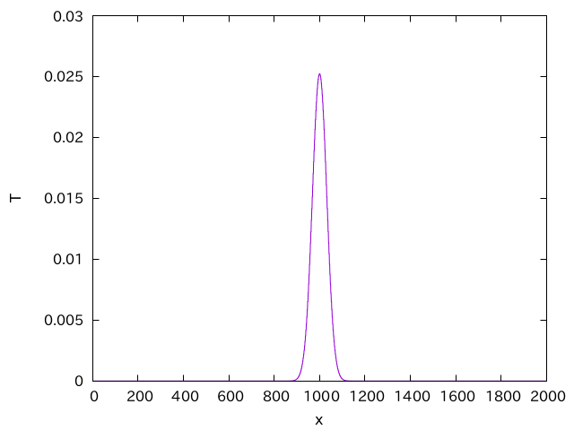

# スタック領域とヒープ領域

Pythonを使う場合にあまり意識しなくて良いが、C/C++を使う場合は意識しなければならないこととして、メモリの種別がある。C/C++が使うメモリには、スタック領域とヒープ領域の区別があり、意識していないと環境依存で振る舞いが変わる厄介なバグを入れることになる。以下、どういう場合に困るか、一つ具体例を見てから簡単に説明する。

## 拡散方程式

一次元拡散方程式を考えよう。空間を適当に分割し、`i`地点での物理量を`x[i]`で表現する。例えば`i`が座標で、`x[i]`がその地点での温度を表すと思えばよい。拡散係数を1、時間刻みを`dt`とすると、次のステップでの`x[i]`の値は

```cpp
x[i] -= (-x[i - 1] + 2.0 * x[i] - x[i + 1]) * dt;
```

で計算できる。しかし、これをそのままループを回して、

```cpp
for (int i = 1; i < N - 1; i++) {
  x[i] -= (-x[i - 1] + 2.0 * x[i] - x[i + 1]) * dt;
}
```

とするとまずい。なぜなら`x[10]`を計算した後、`x[11]`を計算する時に、「現在時刻の`x[10]`」が必要となるが、既に`x[10]`の値が「次の時刻の値」に更新されてしまっているからだ。

そこで単純に、一度`x[i]`の値をテンポラリ配列`xt[i]`にコピーしておき、`x[i-1]`の代わりに`xt[i-1]`を使うことにしよう。以上の方針でプログラムを書くと、例えばこんな感じになろう。

```cpp
#include <cstdio>

const int N = 2000;
const int STEP = 1000;
const double dt = 0.5;
double x[N] = {};

void update() {
  double xt[N];
  for (int i = 0; i < N; i++) {
    xt[i] = x[i];
  }
  for (int i = 1; i < N - 1; i++) {
    x[i] -= (-xt[i - 1] + 2.0 * x[i] - x[i + 1]) * dt;
  }
}

int main() {
  x[N / 2] = x[N / 2 + 1] = 1.0;
  for (int i = 0; i < STEP; i++) {
    update();
  }
  for (int i = 0; i < N; i++) {
    printf("%d %f\n", i, x[i]);
  }
}
```

系をN点に分割し、その中央の二点に値をいれておいて、そのあと`STEP`回だけ拡散方程式を解くものだ。系の中央にデルタ関数的に初期値を与えた拡散方程式の解はガウス分布であり、その分散が時間とともに大きくなっていくことは知っているであろう。このプログラムの実行結果をプロットするとこうなる。



確かに系の中央でガウス分布っぽくなっている。

さて、小さい系でうまくいったことに満足したあなたは、より大きな系で計算を実行しようとして`N`を大きくする。

```cpp
const int N = 2000000;
```

そこそこ大きいサイズに思えるが、計算量は`N*STEP`程度であり、一点あたりの計算も加減乗算が5回程度なので、全体で10G回くらいである。最近のCPUの計算能力はGFlopsクラスであろうから、せいぜい数秒で終わるであろう。そう思ってコンパイル、実行すると、「Segmentation fault」という無情のメッセージを残してプログラムが死ぬ。

あなたはなぜ系のサイズを大きくしただけで、プログラムが死ぬのかわからず、先輩に聞いてみたら、「あ、ここに`static`つけなよ」とだけ言われる。

```cpp
void update() {
  static double xt[N]; // staticをつけた
  for (int i = 0; i < N; i++) {
    xt[i] = x[i];
  }
  for (int i = 1; i < N - 1; i++) {
    x[i] -= (-xt[i - 1] + 2.0 * x[i] - x[i + 1]) * dt;
  }
}
```

言われるままに、関数`update`の一時配列の宣言に`static`とつけて、コンパイル、実行してみる。
